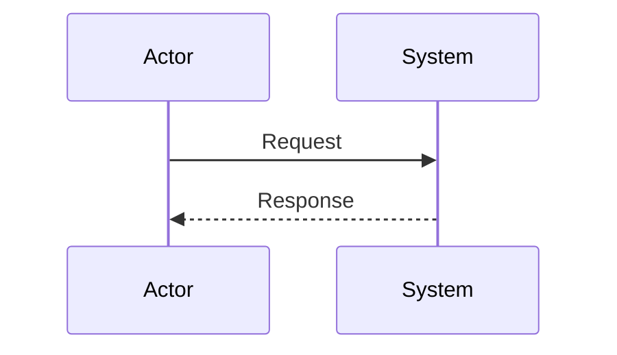

# Технический дизайн

## Контекст и цели

<!-- Ссылки на требования и ключевые ограничения. -->

## Не-цели

- 

## Текущее устройство

<!-- Подтвержденное кодом/конфигурацией AS-IS. -->

## Предлагаемое решение

<!-- Компоненты, взаимодействия, потоки данных. -->

## Контракты и данные

<!-- API/events/data changes with compatibility notes. -->

## Решения и альтернативы

| Решение | Выбранный вариант | Альтернативы | Обоснование / trade-offs | Требования |
|---|---|---|---|---|
|  |  |  |  | SR-001 |

## Безопасность, надежность и наблюдаемость

- 

## Миграция, rollout и rollback

- 

## Риски и открытые вопросы

- 
