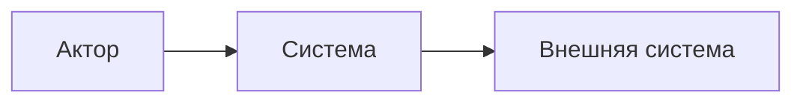
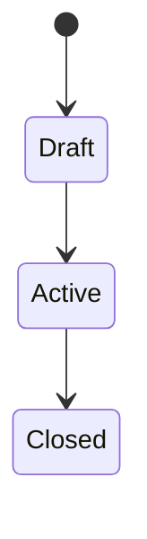

# Системные требования: <название изменения>

## 1. Паспорт документа

| Поле | Значение |
|---|---|
| OpenSpec change | `<change-id>` |
| Статус | Draft / In Review / Approved |
| Владелец | System Analyst |
| Версия | 0.1 |
| Последнее обновление | YYYY-MM-DD |

## 2. Основание и источники

<!-- Ссылки на business-requirements.md, proposal.md, существующие specs, код и контракты. -->

## 3. Системный контекст и границы

<!-- Что входит в систему, что является внешним, кто акторы и внешние системы. -->

## 4. AS-IS и выявленные gaps

| Область | Текущее поведение / доказательство | Требуемое поведение | Gap |
|---|---|---|---|
|  |  |  |  |

## 5. Системные use cases

### UC-001: <название>

- **Акторы:**
- **Предусловия:**
- **Триггер:**
- **Основной поток:**
  1. 
- **Альтернативные потоки:**
  1. 
- **Ошибочные потоки:**
  1. 
- **Постусловия:**
- **Связанные требования:** FR-001, BR-001

## 6. Системные требования

| ID | Требование | Тип | Приоритет | Источник | Проверка |
|---|---|---|---|---|---|
| SR-001 | Система SHALL ... | Functional | Must | FR-001 |  |

## 7. Интерфейсы и API

| ID | Интерфейс / операция | Потребитель | Вход | Выход | Ошибки | Идемпотентность / версия | Связь |
|---|---|---|---|---|---|---|---|
| API-001 |  |  |  |  |  |  | SR-001 |

## 8. События и асинхронное взаимодействие

| ID | Событие | Producer | Consumer | Payload | Гарантии доставки / порядок | Связь |
|---|---|---|---|---|---|---|
| EVT-001 |  |  |  |  |  | SR-001 |

## 9. Требования к данным

| ID | Сущность / атрибут | Требование / ограничение | Источник истины | Жизненный цикл | Классификация | Связь |
|---|---|---|---|---|---|---|
| DATA-001 |  |  |  |  |  | SR-001 |

## 10. Состояния и переходы

| Переход | Условие | Действие | Ошибка / запрет |
|---|---|---|---|
|  |  |  |  |

## 11. Валидации, ошибки и исключительные потоки

| ID | Условие | Ожидаемая реакция системы | Пользовательское/интеграционное сообщение | Повтор / компенсация | Связь |
|---|---|---|---|---|---|
| ERR-001 |  |  |  |  | SR-001 |

## 12. Нефункциональные требования

| ID | Категория | Измеримое требование | Условия измерения | Проверка | Источник |
|---|---|---|---|---|---|
| NFR-001 | Performance |  |  |  | BR-001 / Technical/Internal |

## 13. Безопасность и приватность

| ID | Требование | Угроза / основание | Контроль / ожидаемое поведение | Проверка | Связь |
|---|---|---|---|---|---|
| SEC-001 |  |  |  |  | SR-001 |

## 14. Аудит, логирование и наблюдаемость

| ID | Сигнал / событие | Что фиксировать | Корреляция | Метрика / алерт | Ограничения по данным | Связь |
|---|---|---|---|---|---|---|
| OBS-001 |  |  |  |  |  | SR-001 |

## 15. Совместимость, миграция и rollout

- **Обратная совместимость:**
- **Миграция данных:**
- **Миграция контрактов:**
- **Feature flag / поэтапный rollout:**
- **Rollback:**

## 16. Технические ограничения, зависимости и допущения

### Ограничения

- 

### Зависимости

- 

### Допущения

- 

## 17. Трассировка и покрытие

| Бизнес-требование | Системные требования | OpenSpec spec / scenario | Тест / проверка | Статус |
|---|---|---|---|---|
| FR-001 | SR-001 |  |  | Draft |

## 18. Открытые вопросы и решения для design.md

| ID | Вопрос / требуемое решение | Владелец | Блокирует | Целевой артефакт | Статус |
|---|---|---|---|---|---|
| Q-001 |  |  | Да / Нет | business-requirements.md / design.md |  |

## 19. История изменений

| Версия | Дата | Автор | Изменение |
|---|---|---|---|
| 0.1 | YYYY-MM-DD | System Analyst | Первичная версия |
